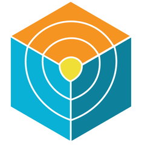

<h1></h1>

## About me

- Hi I am Vijay, from **India 🇮🇳** 
- I am a passionate technology professional committed to continuous learning and innovative problem-solving. 
- Certified Google Cloud (Associate Cloud Engineer), Azure (DP-900, AI-900, AI-102)
- DevOps & Automation: CI/CD, Infrastructure as Code, Container Orchestration,Kubernetes, Docker, Terraform
- Monitoring & Security: Prometheus, Grafana, Security Best Practices
- Open to **collaboration** 
- **Core Competencies**: Adaptive Learning, Technical Problem Resolution, Strategic Implementation.

- ⚡ Fun fact:  I thrive on mindful practices like meditation, connecting deeply with others through meaningful conversations, and cherishing the pure, unconditional companionship of dogs and children.

### Current Status✨
- Working on Building AI solutions
+ GCP (Professional Cloud Architect): In Progress
- Kubernetes (CKA): In Progress

### 📫 How to reach me:
 
 
  

<!--  -->
<!--  -->

  
<!-- ## Languages, Technologies and Tools ⚡ 

 -->

###

<h3 align="left">🛠 Language and Tools</h3>

###

  
  
  
  
  
  
  <!--  -->
  <!--  -->

  
  
  
  
  
  
  
  
  
  
  
  
  
  
  
  
  <!-- 
   -->
  <!-- 
  
   -->
  <!--  -->
  
  
  
  
  

